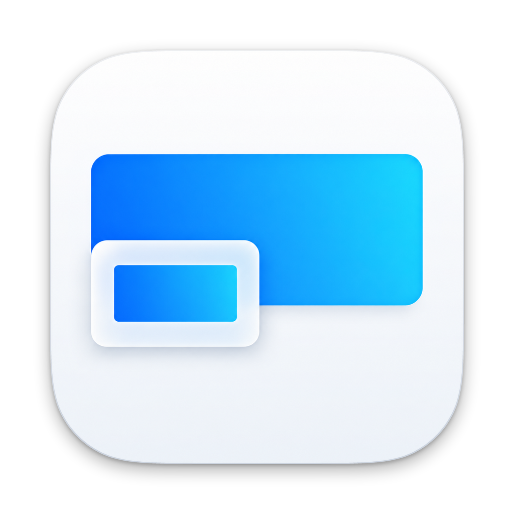
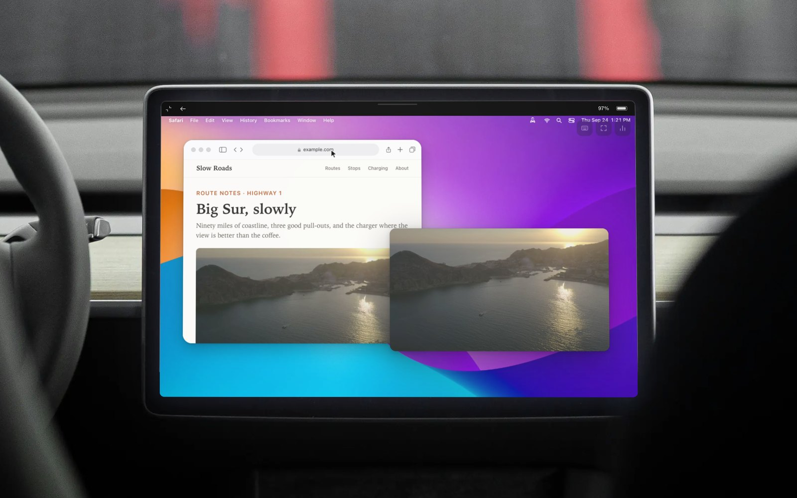
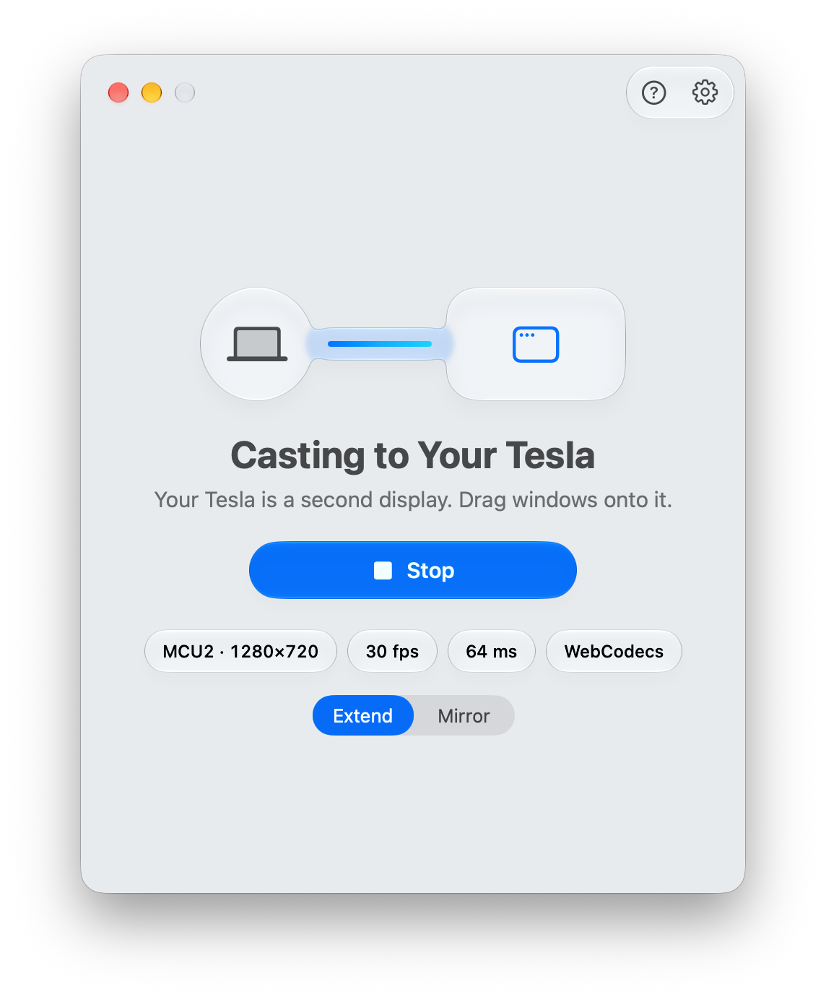
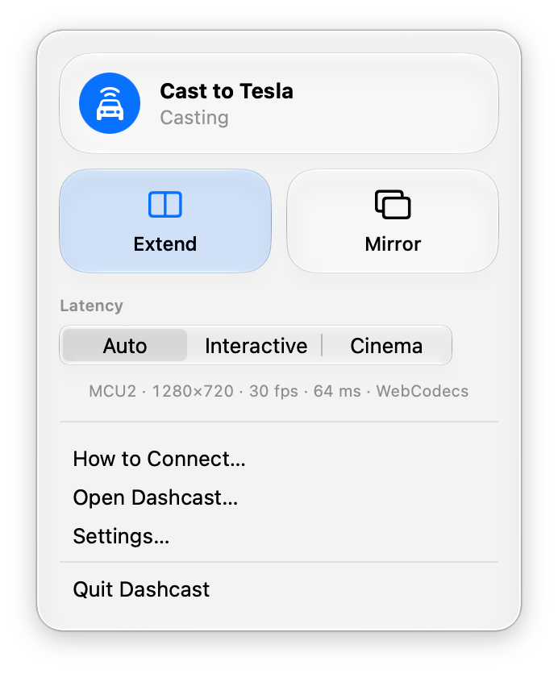
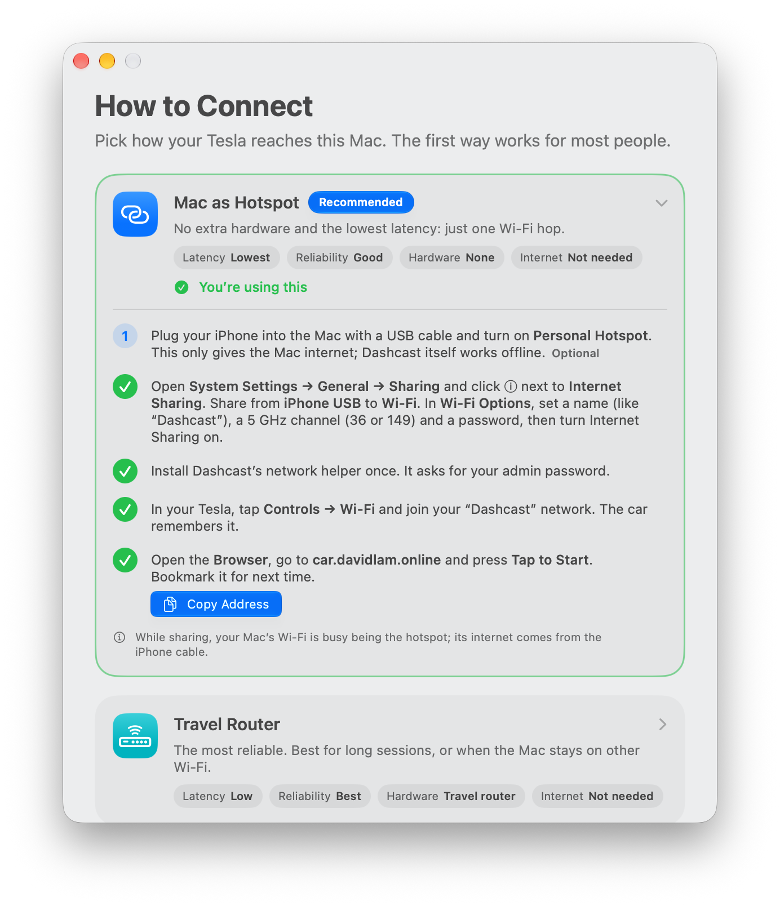

<p align="center">
  
</p>

<h1 align="center">Dashcast</h1>

<p align="center">
  Your Mac, on your Tesla's screen: extend or mirror, touch to control, sound through the car speakers. No cloud.<br>
  <a href="https://dashcast.davidlam.online"><strong>dashcast.davidlam.online</strong></a>
</p>

<p align="center">
  
</p>

Dashcast is a native macOS app that turns a Tesla's touchscreen into a wireless display for your Mac. The car needs nothing installed: it opens a page in its own web browser, and the Mac streams to it over Wi-Fi.

- **Extend or mirror.** Extend adds a virtual HiDPI display sized to the car's screen. Mirror shows the screen you're on.
- **Touch is the mouse.** Tap to click, drag, two-finger scroll, long-press to right-click. A keyboard works too.
- **Sound through the car.** Your Mac's audio plays through the car speakers, in sync with the video:
  - **Cinema**: a 250 ms buffer where audio is the master clock.
  - **Interactive**: about 60 ms.
  - **Auto**: switches to Cinema while something plays.
- **Built for MCU2 and MCU3.** The quality tier is picked from how fast the car decodes, then adjusted live:
  - Intel Atom (MCU2): 720p30 H.264.
  - AMD Ryzen (MCU3): 60 fps H.264 High or HEVC.
- **No cloud, no internet.** Everything stays between your Mac and your car.

<p align="center">
  <picture>
    <source media="(prefers-color-scheme: dark)" srcset="website/shots-raw/captures/dark-main-casting-extend.png">
    
  </picture>
  <picture>
    <source media="(prefers-color-scheme: dark)" srcset="website/shots-raw/captures/dark-menu-casting.png">
    
  </picture>
  <picture>
    <source media="(prefers-color-scheme: dark)" srcset="website/shots-raw/captures/dark-guide.png">
    
  </picture>
</p>

## Download

Get **[Dashcast-0.0.1.dmg](https://github.com/dw2lam/Dashcast/releases/latest)** from Releases, open it, and drag Dashcast to Applications.

Dashcast isn't notarized yet. On first launch, macOS will say it can't verify the app: go to **System Settings → Privacy & Security** and click **Open Anyway**. The setup assistant takes it from there.

## How it connects

**The Tesla browser refuses private LAN addresses** (192.168.x, 10.x, 172.16–31.x). That's why opening a home server's IP in the car fails. Dashcast instead:
- serves from **203.0.113.77**, a reserved documentation address that isn't private, bound to the Mac itself;
- answers the car's DNS and its connectivity check on the Mac, so the car is happy with no internet at all.

**Two modes are picked automatically:**
- **Compatibility:** plain `http://203.0.113.77`, streamed over WebRTC. No setup needed.
- **Secure (optional):** HTTPS on a domain you own, with a free Let's Encrypt certificate. This unlocks WebCodecs, the lowest-latency path.

**Setting up Secure mode.** In **Settings → Network → Secure Mode**, enter a name on a domain you own, such as `car.yourdomain.com`, and pick its DNS provider:
- **Cloudflare (automatic):** on [Cloudflare's API Tokens page](https://dash.cloudflare.com/profile/api-tokens), click **Create Token**, use the **Edit zone DNS** template, add **Zone · Zone · Read**, and set **Zone Resources** to your domain. Paste the token into Dashcast (it stays in your Keychain) and click **Get Certificate**. Dashcast adds the A record `car.yourdomain.com → 203.0.113.77` (DNS only, not proxied) and gets the certificate over DNS-01. Renew it from the same place.
- **Any other DNS provider:** add the A record yourself (`car.yourdomain.com`, `A`, `203.0.113.77`, not proxied), get a certificate for that name, and import it: a `.p12` with its passphrase, or PEM certificate and key files. Automatic certificates are Cloudflare-only for now.

The Connection Guide and the setup assistant link to the same settings.

**Choose how the car reaches your Mac:**

| Method | | |
|---|---|---|
| **Mac as Hotspot** | Recommended | Internet Sharing makes the Mac's own Wi-Fi and the car joins it. One hop, lowest latency. Plug your iPhone into the Mac over USB (or share an Android phone's internet over Bluetooth) if you want internet too. |
| **Travel Router** | Most reliable | For example a GL.iNet router. Dashcast generates the router setup. |
| **Phone hotspot for both** (iPhone or Android) | Not supported | The car sends everything to the phone, which can't pass it on to the Mac, and phone hotspots hand out private addresses the Tesla browser blocks. The phone can still supply internet: an iPhone over USB, an Android phone over Bluetooth tethering, or either one feeding a travel router. |

**In the car:**
1. Join the Mac's Wi-Fi.
2. Open the Browser.
3. Go to `http://203.0.113.77` (or your own domain, in Secure mode).
4. Tap to Start. The tap turns on sound.
5. Go fullscreen.

## Requirements

- macOS 15 or later, on Apple silicon. On macOS 26 the app uses Liquid Glass.
- Version 0.0.1 is an early build, not yet tested in a car.
- A Tesla with the in-car browser. Built on an MCU2 Model 3 and designed for MCU3.
- Screen Recording and Accessibility permissions. The setup assistant walks you through them.

## Build from source

```sh
scripts/build-app.sh      # web client + libdatachannel (first run) + release build → build/Dashcast.app
scripts/make-dmg.sh       # build/Dashcast.app → build/Dashcast.dmg
```

- **Tools:** Xcode, Node, `cmake` and `git`.
- **libdatachannel:** it and Mbed TLS are built from source into `Vendor/` on the first run.
- **Certificates:** `brew install lego` if you want Secure mode's certificate tool (Cloudflare domains) bundled.
- **Tests:** `swift test`.

| Path | What's there |
|---|---|
| `Sources/Dashcast` | The SwiftUI app: main window, menu bar panel, Settings, setup assistant, Connection Guide |
| `Sources/DashcastStream` | Virtual display, ScreenCaptureKit capture, VideoToolbox H.264/HEVC/JPEG, audio, input |
| `Sources/DashcastServer` | HTTP/WebSocket server, quality tiers, congestion control, latency modes |
| `Sources/DashcastNetwork` | Topology detection, the loopback alias + pf helper, local DNS, certificates, router setup |
| `Sources/DashcastRTC` | WebRTC for Compatibility mode (libdatachannel) |
| `Web/` | The page the car loads: WebCodecs/WebRTC playback, A/V sync, touch |
| `website/` | [dashcast.davidlam.online](https://dashcast.davidlam.online) |
| `PROTOCOL.md` | The wire protocol between the Mac and the car |

## Donate

Dashcast is free and open source. A donation isn't required, but it's greatly appreciated and helps fund the updates and fixes planned from your suggestions.

[](https://paypal.me/dw2lam)

## License

[MIT](LICENSE). Photos and footage on the website carry their own licences, listed in [website/research/LICENSES.md](website/research/LICENSES.md).

## Safety

Dashcast is for when you're parked or charging, or for a passenger. Don't watch the screen while driving.

---

Dashcast is an independent project and is not affiliated with, endorsed by, or connected to Tesla, Inc. "Tesla" is a trademark of Tesla, Inc. Mac and macOS are trademarks of Apple Inc.
